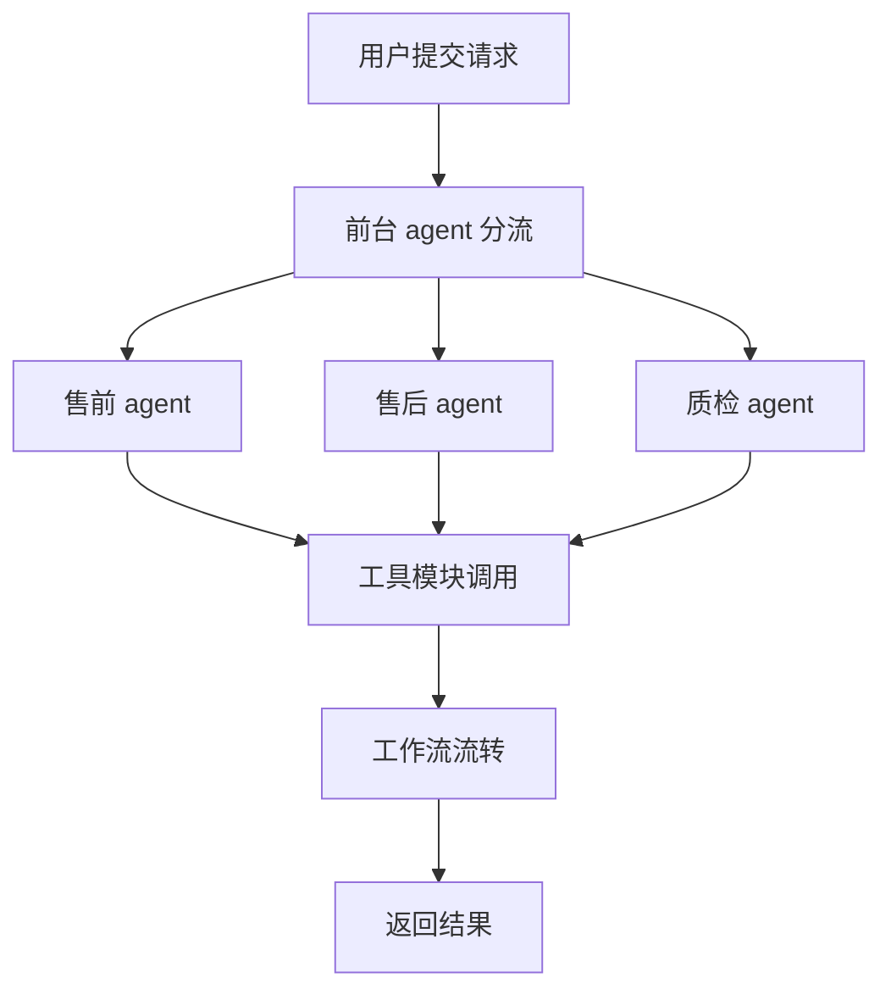

# Agent Multi 智能体系统

## 项目简介
本项目是一个多智能体系统，集成了售前、售后、质检、前台等多种业务 agent，支持知识库检索、数据库操作、工作流管理等功能。系统采用模块化设计，便于扩展和维护，适用于企业自动化客服、业务流程自动化等场景。

## 目录结构说明
```
├── agents/                # 各类智能体实现（售前、售后、质检、前台等）
├── callbacks/             # 回调处理相关模块
├── data/                  # 业务数据与数据库（如订单、用户、品牌等）
├── faiss_index/           # 向量索引文件（知识库检索用）
├── kg/                    # 知识图谱相关模块与数据
├── sessions/              # 会话数据库
├── tools/                 # 工具模块（知识库检索、售前/售后工具等）
├── work_flow/             # 工作流与数据传输对象
├── gradio_app.py          # Gradio Web界面入口
├── llm.py                 # 大模型接口
├── main.py                # 主程序入口
├── requirements.txt       # 依赖包列表
└── README.md              # 项目说明文档
```

## 安装与环境配置
1. 克隆项目
   ```bash
   git clone <your-repo-url>
   cd agent_multi
   ```
2. 安装依赖
   ```bash
   pip install -r requirements.txt
   ```
3. 初始化数据库与数据
   - 数据库初始化脚本位于 `data/init_aftersales_db.py`。
   - 生成模拟数据可运行 `data/generate_aftersales_data.py`。
4. 知识库向量化
   - 使用 `kg/ingest.py` 进行知识库 FAQ 的向量化处理，生成 `faiss_index/` 下的索引文件。

## 使用方法
### 启动主程序
```bash
python main.py
```
### 启动 Gradio Web 界面
```bash
python gradio_app.py
```

## 主要功能
- 多智能体协作：支持售前、售后、质检、前台等多种业务 agent，自动分流处理用户请求。
- 知识库检索：集成 FAISS 向量检索，支持 FAQ 问答、知识图谱查询。
- 业务数据管理：订单、用户、品牌、物流等多类业务数据，支持数据库操作。
- 工作流引擎：灵活的数据流与节点路由，支持复杂业务流程自动化。
- 工具扩展：可自定义工具模块，支持业务功能扩展。

## 主要模块说明
- `agents/`：各类业务 agent，负责具体业务处理与工具调用。
- `tools/`：工具模块，提供知识库检索、售前/售后业务操作等能力。
- `kg/`：知识图谱相关，包含 FAQ 数据、嵌入生成与检索。
- `work_flow/`：工作流与数据传输对象，支持 agent 间的数据流转。
- `data/`：业务数据与数据库，支持初始化与模拟数据生成。
- `gradio_app.py`：Web 界面入口，便于交互测试。
- `llm.py`：大模型接口，支持自然语言理解与生成。

## 流程说明
1. 用户通过 Gradio Web 界面或主程序入口提交请求。
2. 前台 agent（receptionist_agent）接收请求，进行初步分流。
3. 根据请求类型，分配给售前、售后、质检等业务 agent。
4. 各 agent 可调用工具模块（如知识库检索、数据库操作等）完成具体任务。
5. 工作流模块（work_flow/）负责 agent 间的数据流转和节点路由。
6. 处理结果通过 Web 界面或 API 返回给用户。

### 系统流程图


## 扩展与定制
- 新增 agent：在 `agents/` 目录下添加新的 agent 类，并在主流程中注册。
- 新增工具：在 `tools/` 目录下实现新工具，并在 agent 中调用。
- 数据扩展：在 `data/` 目录下添加新的业务数据文件或数据库表。
- 知识库扩展：更新 `kg/faq.csv` 并重新运行 `kg/ingest.py` 生成新索引。

## 依赖环境
- Python 3.10+
- 主要依赖见 `requirements.txt`，如 gradio、faiss、sqlite3、pandas 等。

## 联系与反馈
如有问题或建议，请提交 issue 或联系项目维护者。

---

如需更详细的开发文档或 API 说明，请查阅各模块源码及注释。
